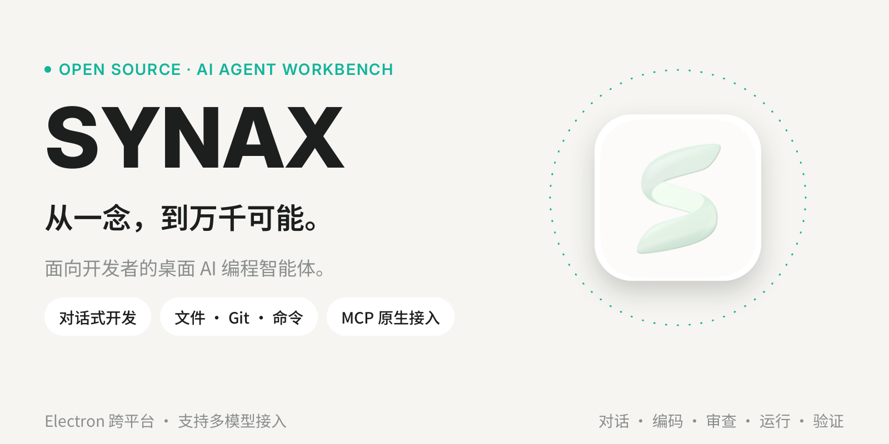

<div align="center">



# Synax

A local workspace for coding agents and codebase documentation.

English | [简体中文](./README.zh-CN.md)

</div>

Synax brings agent conversations, source files, diffs, and a terminal into one app. Import a local project to start working with an agent, or generate a Wiki to read through its architecture and follow references back to the code.

The project is in alpha. Wiki and planning are experimental and disabled by default.

## Quick Start

### 1. Requirements

Install [Node.js](https://nodejs.org) **22** (`>=22 <23`), npm 10 or later, and Git. Native dependencies also need Python 3 and a C/C++ build toolchain:

| System  | Build tools                                                                           |
| ------- | ------------------------------------------------------------------------------------- |
| macOS   | Xcode Command Line Tools (`xcode-select --install`)                                   |
| Windows | Visual Studio **2022** Build Tools with the **Desktop development with C++** workload |
| Linux   | GCC, G++, and Make; on Debian/Ubuntu, install `build-essential`                       |

### 2. Install dependencies

```bash
git clone https://github.com/coldmint9/Synax.git
cd Synax
npm install
```

### 3. Start the app

Pick one of the two entry points below. Both share the same local API and agent runtime.

#### Web (browser)

One command starts both the API and the frontend:

```bash
npm run dev:all
```

`npm run dev` is an alias for the same script. The API listens on `3210` and the web development server on `5173`; then open [localhost:5173](http://localhost:5173).

#### Production Web mode for everyday use (recommended)

```bash
npm run build
npm run web:build
npm run start:web
```

This serves the built frontend on port `5173` after the local runtime reports ready, with realtime observations on a shared WebSocket. Keep `dev:all` for development. Do not start two runtime owners for the same `DATA_ROOT`; set `SYNAX_API_ORIGIN=http://127.0.0.1:<port>` to explicitly attach to an existing compatible runtime instead.

For HTTP/2, provide a TLS certificate for `localhost` that your browser trusts:

```bash
WEB_TLS_CERT=/absolute/path/localhost-cert.pem WEB_TLS_KEY=/absolute/path/localhost-key.pem npm run start:web
```

The TLS entry uses HTTP/2 for ordinary requests/assets and compatible HTTP/1.1 upgrades for WebSocket. Without certificates, HTTP/1.1 plus shared WebSocket is supported. The app never installs a root certificate, bypasses certificate validation, or relaxes authorization. When changing `WEB_PORT`, an independently started backend must allow the same origin port.

#### Local storage maintenance (read-only by default)

Inspect database pages, freelist, WAL, FTS, cache, replay, and process-receipt categories:

```bash
npm run storage:report
```

Maintenance is not automatic. Point it at a copy and stop the runtime first:

```bash
SYNAX_DB_PATH=/absolute/path/context.db npm run storage:maintain
SYNAX_DB_PATH=/absolute/path/context.db npm run storage:compact
```

The command creates a consistent `VACUUM INTO` backup and refuses to overwrite an existing backup. It does not remove authoritative messages, events, billing, checkpoints, forks, undo records, or asset references. Never run mutating maintenance against a live `~/.synax/context.db`.

#### Desktop (Electron)

```bash
npm run dev:desktop
```

This compiles the Electron TypeScript sources, starts the API and web servers, waits for both to be ready, and then launches Electron with hot reload (`electronmon`). A desktop window opens automatically; no browser is needed.

To produce an installable desktop build instead of running it in development mode:

```bash
npm run make:desktop
```

Artifacts are written to `out/make/`. Build on the target operating system **and CPU architecture** — libSQL, tree-sitter, and node-pty ship native binaries. Packaged apps include their own runtime, so end users do not need a separate Node.js installation.

You can also start the two servers separately, for example when running the API in one terminal and the frontend in another:

```bash
npm run dev:api   # API only, port 3210
npm run dev:web   # Web only, port 5173
```

### 4. Configure and start working

1. Open Settings and add a model provider, API key, and model.
2. Import a local project directory.
3. Start a conversation with the built-in Synax agent.

### Ports

| Variable   | Default   | Purpose                             |
| ---------- | --------- | ----------------------------------- |
| `PORT`     | `3210`    | API port                            |
| `WEB_PORT` | `5173`    | Web development server port         |
| `WEB_HOST` | `0.0.0.0` | Web development server bind address |

Set these in the shell that launches the development scripts.

## Local Git merge requests

Open **Git** from an imported project's header to create a local MR. Select a target and one or more ordered sources, using merge commits, per-source squash, or fast-forward-only. Synax prepares the entire batch in an isolated worktree before updating the local target.

- Conflicts use the same file viewer as sessions: three-way comparison, per-line choices, direct edits, undo/redo, and persisted drafts/decisions.
- Configure checks as an executable, JSON argument array and timeout. One-click presets can apply the candidate after every check passes. Checks execute project code; configure only trusted commands.
- Updating a checked-out target requires explicit opt-in when creating the MR and a clean, idle target worktree. Stale branches and file revisions are rejected.
- The optional Git Manager uses the configured model to inspect the bound MR and propose patches for review. It cannot directly publish branches or push. Manual MR works without a model.
- Failed/interrupted operations can be reconciled and resumed. Cancellation preserves the candidate worktree and drafts. Local records live under the Synax data directory's `git-mr` folder.

Automation currently means manually triggered one-click presets, not scheduled runs. Unsupported structural conflicts, such as submodules, stop explicitly for external resolution. The feature does not push or delete source branches. Tracked `.DS_Store` files and merges from test/beta into feature branches are rejected.

## License

[MIT](./LICENSE)
