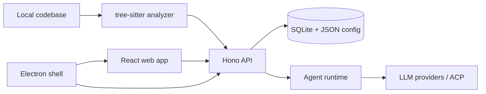

<div align="center">

# Synax

Local-first AI code intelligence workbench for codebase wikis, agent sessions, and implementation context.

English | [Simplified Chinese](./README.zh-CN.md)


</div>

## Supported LLM Providers

First things first: models. Synax currently exposes provider setup for OpenAI and Anthropic, plus presets for DeepSeek, OpenRouter, and xAI through custom API connections.

It also supports custom endpoints that speak one of these API formats:

- OpenAI Chat Completions compatible
- OpenAI Responses compatible
- Anthropic Messages compatible

Author note: Synax is currently developed and dogfooded mostly with DeepSeek V4. If a few paths feel especially friendly to DeepSeek users, that is not a coincidence.

Because this is `0.1.0-snapshot`, provider details are still evolving. Some lower-level runtime adapters exist in code, but they should not be treated as product-ready provider support until they are wired into configuration, validation, and the UI.

## Overview

Synax helps engineering teams keep AI-assisted development grounded in the real codebase. Import a local repository, generate a source-linked design wiki, run scoped agent sessions, and keep project memory, decisions, and implementation context searchable over time.

The project is built as a TypeScript monorepo with a Hono API, React web client, SQLite persistence, tree-sitter based code analysis, a profile-driven agent runtime, and an Electron desktop shell.

## Product Goal

Synax aims to become a local-first AI engineering workspace that turns a codebase into durable, reusable context: source-linked design documents, executable plans, agent run history, implementation evidence, and project memory.

The long-term goal is to let humans define intent and boundaries, let agents execute bounded work with clear permissions, and continuously reconcile plans, documentation, and code reality as the product evolves.

## Philosophy

Synax is built around a few practical beliefs:

- The codebase is the source of truth. Documents, plans, and agent memory must point back to real files, symbols, and changes instead of floating above the work.
- Humans own intent. AI can explore, summarize, draft, and execute, but product direction, tradeoffs, and risk acceptance should remain explicit human decisions.
- Agents should be bounded collaborators, not mysterious background magic. Every useful agent run needs context, permissions, evidence, and a recoverable history.
- Documentation should stay alive. A wiki that cannot notice code drift becomes another stale artifact; Synax treats docs as something to refresh, patch, review, and trace.
- Local-first is a trust feature. Source code, credentials, runtime state, and project memory should stay under the user's control by default.
- Context is compound interest. Every run, decision, and correction should make the next run cheaper, safer, and less confused.

## Version Status

Current version: `0.1.0-snapshot`.

This is an early development snapshot, not a stable release. Many product details, interaction flows, runtime boundaries, and engineering hardening work are still incomplete.

Currently available or actively evolving:

- Local project import and project metadata management.
- Codebase scanning, source indexing, and Wiki generation/refresh foundations.
- LLM provider configuration and local runtime settings.
- Agent session runtime foundations, including streamed events, session state, and permission records.
- Electron desktop packaging foundations.

Known incomplete or unstable areas:

- Plan-related workflows are still experimental and not complete.
- ACP-related discovery, connection, execution, and end-to-end workflows are not complete.
- Permission approval UX, error handling, recovery flows, and safety boundaries still need refinement.
- API contracts, data schemas, prompts, and UI details may change without compatibility guarantees before a stable release.
- Tests, packaging, documentation, and production readiness still need more hardening.

## Highlights

- Codebase Design Wiki: generate hierarchical documentation from source, bind wiki blocks back to files and symbols, export Markdown, and refresh docs when code changes.
- Agent Runtime: run planner, executor, reviewer, explorer, and wiki-specific profiles with streaming events, permission gates, pause, resume, cancel, and session history.
- Context Memory: persist project context, conversations, run evidence, token warnings, compression state, and searchable memory in local SQLite.
- Code Intelligence: index TypeScript, TSX, JavaScript, JSX, Python, Java, C, C++, C#, Go, Rust, PHP, Ruby, Kotlin, Swift, SQL, and shell files.
- Provider Flexibility: configure OpenAI, Anthropic, DeepSeek, OpenRouter, xAI, and custom compatible API endpoints.
- Web and Desktop: use Synax as a standalone Vite web app or package it as an Electron desktop app with a bundled API sidecar.

## Architecture



This diagram is the lobby map, not the full tour. For the real architecture walkthrough, install Synax, import this repository, and generate the Wiki. The project is built to explain codebases, so yes, it can explain itself. Very polite of it.

## Quick Start

### Prerequisites

- Node.js 24 or newer.
- npm 10 or newer.
- Git.
- A native build toolchain for tree-sitter packages. On macOS, install Xcode Command Line Tools.
- At least one LLM provider key or an available ACP runtime if you want to generate wiki content or run agents.

### Install

```bash
git clone https://github.com/weiweizwc98/Synax.git
cd Synax
npm install
```

### Run the Web App

```bash
npm run dev
```

The API starts at `http://localhost:3210` and the web app starts at `http://localhost:5173`.

Recommended first run:

1. Open `http://localhost:5173`.
2. Go to Settings and configure an LLM or ACP provider.
3. Import a local project directory.
4. Open the Wiki tab and generate the first Codebase Design Wiki.

### Run the Desktop App

```bash
npm run dev:desktop
```

In development, Electron uses the local web and API servers. In packaged builds, Electron starts the bundled API sidecar.

## Configuration

Synax reads `.env` automatically through `dotenv/config`, but no template file is required. Create `.env` only when you need to override defaults.

| Variable | Default | Description |
| --- | --- | --- |
| `PORT` | `3210` | API server port. |
| `WEB_PORT` | `5173` | Vite development server port. |
| `WEB_HOST` | `0.0.0.0` | Vite development server host used by dev scripts. |
| `DATA_ROOT` | `.data` | Local data directory for SQLite, project metadata, config, logs, and model catalog cache. |
| `LOG_LEVEL` | `info` | API log level. |
| `CONFIG_ENCRYPTION_KEY` | unset | Secret used to encrypt stored provider keys. |
| `Synax_CONFIG_SECRET` | unset | Alternative secret used for config encryption. |
| `CONTEXT_SESSION_TTL_HOURS` | `72` | Context session expiration window. |
| `CONTEXT_TOKEN_WARNING_THRESHOLD` | `32000` | Token warning threshold for context sessions. |
| `CONTEXT_MEMORY_MAX_PER_PROJECT` | `500` | Maximum stored memory entries per project. |

Runtime data is local by default and is ignored by Git. Use a stable `CONFIG_ENCRYPTION_KEY` or `Synax_CONFIG_SECRET` before storing provider credentials you intend to keep across machines or environments.

## Scripts

| Command | Description |
| --- | --- |
| `npm run dev` | Start API and web dev servers together. |
| `npm run dev:api` | Start only the Hono API server. |
| `npm run dev:web` | Start only the Vite web app. |
| `npm run dev:desktop` | Start API, web, Electron compiler watch, and Electron. |
| `npm run build` | Bundle the API server into `server-dist/`. |
| `npm run start` | Run the bundled API server. |
| `npm run web:build` | Build the web app into `web/dist/`. |
| `npm run typecheck` | Run TypeScript checks for the root project. |
| `npm run lint` | Lint API code. |
| `npm run test` | Run Vitest tests. |
| `npm run build:desktop` | Package a local Electron app. |
| `npm run make:desktop` | Create distributable Electron artifacts. |

## Project Layout

```text
api/        Hono routes, SQLite schema, migrations, analyzer, wiki, context, and agent runtime
web/        React 19, Vite, HeroUI, Zustand, wiki UI, sessions UI, settings, and API clients
electron/   Desktop shell, preload bridge, menu integration, window state, and API sidecar launcher
scripts/    Development bootstrap scripts for API, web, desktop, and combined workflows
docs/       Design notes and technical plans for the Codebase Design Wiki
```

## API Surface

The API is mounted under `/api` and organized by domain:

- `/api/projects` for project metadata and local imports.
- `/api/wiki` for snapshots, documents, blocks, refresh drafts, patches, exports, and design mapping.
- `/api/agent-runtime` for profiles, skills, contexts, sessions, streamed turns, permissions, and runtime events.
- `/api/config` and `/api/llm` for provider configuration and model discovery.
- `/api/context` for memory, coordinates, sessions, and contextual signals.
- `/api/acp` for Agent Client Protocol discovery and provider integration.
- `/api/notifications`, `/api/logs`, and `/api/health` for operational support.

## Development Workflow

1. Keep changes focused and small enough to review.
2. Add or update tests when touching runtime behavior, persistence, route contracts, or wiki generation.
3. Run the relevant checks before opening a pull request:

```bash
npm run typecheck
npm run test
npm run lint
```

## Packaging

Build all runtime assets and package the desktop app:

```bash
npm run build:desktop
```

Create distributable artifacts with Electron Forge:

```bash
npm run make:desktop
```

Packaged builds include `server-dist`, `web/dist`, and database migrations as Electron resources.

## Contributing

Contributions should include a clear problem statement, a focused implementation, and verification notes. For larger changes, open an issue or design discussion first so the runtime, persistence, and UI impact can be reviewed before code lands.

## License

Synax is released under the [MIT License](./LICENSE).
