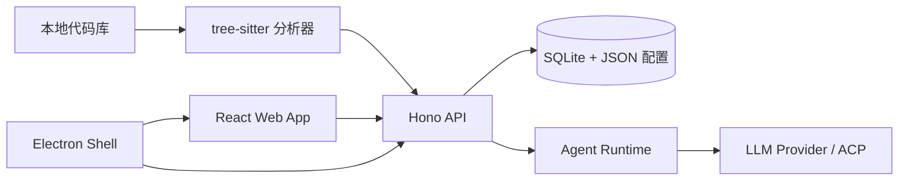

<div align="center">

# Synax

把本地代码库生成可追溯、可刷新的设计 Wiki，并让它成为 Agent 理解项目和协作开发的上下文底座。

[English](./README.md) | 简体中文


</div>

## 支持的 LLM 供应商

先说大家最关心的模型。Synax 目前在产品配置里支持 OpenAI 和 Anthropic，并通过自定义 API 连接预置了 DeepSeek、OpenRouter 和 xAI。

同时支持接入符合以下协议格式的自定义端点：

- OpenAI Chat Completions compatible
- OpenAI Responses compatible
- Anthropic Messages compatible

作者目前主要用 DeepSeek V4 开发和自测 Synax。如果某些路径看起来对 DeepSeek 用户特别顺手，这不是错觉。

由于当前仍是 `0.1.0-snapshot`，Provider 细节还在演进中。代码里有一些更底层的 runtime adapter，但在完成配置、校验和 UI 串联之前，不应把它们视为已经产品化支持的 Provider。

## 项目概览

Synax 围绕一个核心闭环构建：导入本地代码库，分析文件与符号，生成带源码绑定的 Codebase Design Wiki，并在代码变化后持续刷新这份 Wiki。

这份 Wiki 不是摆着好看的文档。它是项目的结构化上下文层：架构、模块、API、流程、风险、决策、源码引用、刷新草稿和未来 Agent 工作，都应该在这里汇合，并且始终贴着真实代码走。

项目采用 TypeScript monorepo 架构，包含 Hono API、React Web 客户端、SQLite 本地持久化、基于 tree-sitter 的代码分析、Profile 驱动的 Agent Runtime，以及 Electron 桌面壳。

## 产品目标

Synax 的目标是成为一个本地优先的 AI 研发工作台，把代码库转化为可长期复用的上下文：可追溯到源码的设计文档、可执行计划、Agent 运行历史、实现证据和项目记忆。

长期目标是让人负责定义意图和边界，让 Agent 在明确权限约束下执行有限任务，并在产品演进过程中持续对齐计划、文档和真实代码。

## 项目理念

Synax 基于几个很朴素的判断：

- 代码库是真相源。文档、计划和 Agent 记忆必须能追溯到真实文件、符号和变更，而不是飘在代码上方自说自话。
- 人负责意图。AI 可以探索、总结、起草和执行，但产品方向、取舍和风险接受必须是清晰的人类决策。
- Agent 应该是有边界的协作者，而不是神秘的后台魔法。一次有价值的 Agent 运行需要上下文、权限、证据和可恢复的历史记录。
- 文档应该是活的。不能感知代码漂移的 Wiki 很快会变成另一份过期资产；Synax 把文档视为需要刷新、打补丁、review 和追溯的对象。
- 本地优先是一种信任设计。源码、凭据、运行状态和项目记忆默认应该由用户自己控制。
- 上下文会复利。每一次运行、决策和纠正，都应该让下一次运行更便宜、更安全、更不迷路。

## 版本说明

当前版本：`0.1.0-snapshot`。

这只是一个早期开发快照，不是稳定发布版本。很多产品细节、交互流程、运行边界和工程稳定性工作都还没有完善。

当前已经具备或正在完善的能力：

- 本地项目导入和项目元数据管理。
- 代码库扫描、源码索引，以及 Wiki 生成和刷新基础能力。
- LLM Provider 配置和本地运行时设置。
- Agent Session Runtime 基础能力，包括流式事件、会话状态和权限记录。
- Electron 桌面端打包基础能力。

当前尚未完成或仍不稳定的部分：

- Plan 相关工作流仍处于实验阶段，尚未完成。
- ACP 相关的发现、连接、执行和端到端工作流尚未完成。
- 权限审批体验、错误处理、恢复流程和安全边界仍需要继续打磨。
- 稳定版本发布前，API 契约、数据结构、Prompt 和 UI 细节都可能继续变化，不保证兼容。
- 测试、打包、文档和生产可用性还需要进一步加强。

## 核心能力

- Codebase Design Wiki：从源码生成分层文档，把 Wiki 内容绑定到文件和符号，支持 Markdown 导出，并在代码变化后进行增量刷新。
- Agent Runtime：内置 planner、executor、reviewer、explorer 和 Wiki 专用 Profile，支持流式事件、权限闸门、暂停、恢复、取消和会话历史。
- Context Memory：把项目上下文、对话、运行证据、token 预警、压缩状态和可搜索记忆保存在本地 SQLite。
- Code Intelligence：索引 TypeScript、TSX、JavaScript、JSX、Python、Java、C、C++、C#、Go、Rust、PHP、Ruby、Kotlin、Swift、SQL 和 shell 文件。
- Provider Flexibility：支持配置 OpenAI、Anthropic、DeepSeek、OpenRouter、xAI，以及自定义兼容 API 端点。
- Web 与桌面端：既可以作为 Vite Web 应用独立运行，也可以打包为带 API sidecar 的 Electron 桌面应用。

## 架构



这张图只是大厅导览，不是完整参观路线。想看真正细的架构说明，可以安装 Synax 后把这个仓库导进去，然后生成 Wiki 自己看。本项目本来就是干这个的，让它讲自己，多少有点自觉。

## 快速开始

### 环境要求

- Node.js 24 或更高版本。
- npm 10 或更高版本。
- Git。
- tree-sitter 依赖需要原生构建工具。macOS 请安装 Xcode Command Line Tools。
- 如需生成 Wiki 或运行 Agent，需要至少配置一个 LLM Provider key，或准备一个可用的 ACP Runtime。

### 安装

```bash
git clone https://github.com/coldmint9/Synax.git
cd Synax
npm install
```

### 启动 Web 应用

```bash
npm run dev
```

API 默认启动在 `http://localhost:3210`，Web 应用默认启动在 `http://localhost:5173`。

首次使用建议流程：

1. 打开 `http://localhost:5173`。
2. 进入 Settings，配置 LLM 或 ACP Provider。
3. 导入一个本地项目目录。
4. 打开 Wiki 页面，生成第一份 Codebase Design Wiki。

### 启动桌面应用

```bash
npm run dev:desktop
```

开发模式下，Electron 会连接本地 Web 和 API 服务。打包后，Electron 会启动内置的 API sidecar。

## 配置

Synax 会通过 `dotenv/config` 自动读取 `.env`，但项目不要求必须提供模板文件。只有在需要覆盖默认值时才需要手动创建 `.env`。

| 变量 | 默认值 | 说明 |
| --- | --- | --- |
| `PORT` | `3210` | API 服务端口。 |
| `WEB_PORT` | `5173` | Vite 开发服务端口。 |
| `WEB_HOST` | `0.0.0.0` | 开发脚本使用的 Vite host。 |
| `DATA_ROOT` | `.data` | 本地数据目录，用于 SQLite、项目元数据、配置、日志和模型目录缓存。 |
| `LOG_LEVEL` | `info` | API 日志级别。 |
| `CONFIG_ENCRYPTION_KEY` | 未设置 | 用于加密本地保存的 Provider key。 |
| `Synax_CONFIG_SECRET` | 未设置 | 配置加密的备用密钥。 |
| `CONTEXT_SESSION_TTL_HOURS` | `72` | Context session 过期时间。 |
| `CONTEXT_TOKEN_WARNING_THRESHOLD` | `32000` | Context session 的 token 预警阈值。 |
| `CONTEXT_MEMORY_MAX_PER_PROJECT` | `500` | 单项目最大记忆条目数。 |

运行数据默认保存在本地，并且不会提交到 Git。如果你希望长期保存或跨环境迁移 Provider 凭据，请在写入凭据前设置稳定的 `CONFIG_ENCRYPTION_KEY` 或 `Synax_CONFIG_SECRET`。

## 常用脚本

| 命令 | 说明 |
| --- | --- |
| `npm run dev` | 同时启动 API 和 Web 开发服务。 |
| `npm run dev:api` | 仅启动 Hono API 服务。 |
| `npm run dev:web` | 仅启动 Vite Web 应用。 |
| `npm run dev:desktop` | 启动 API、Web、Electron 编译监听和 Electron。 |
| `npm run build` | 将 API 服务打包到 `server-dist/`。 |
| `npm run start` | 运行已打包的 API 服务。 |
| `npm run web:build` | 将 Web 应用构建到 `web/dist/`。 |
| `npm run typecheck` | 运行根项目 TypeScript 检查。 |
| `npm run lint` | 检查 API 代码。 |
| `npm run test` | 运行 Vitest 测试。 |
| `npm run build:desktop` | 打包本地 Electron 应用。 |
| `npm run make:desktop` | 使用 Electron Forge 生成可分发产物。 |

## 项目结构

```text
api/        Hono 路由、SQLite schema、迁移、分析器、Wiki、Context 和 Agent Runtime
web/        React 19、Vite、HeroUI、Zustand、Wiki UI、Sessions UI、设置和 API Client
electron/   桌面壳、preload bridge、菜单集成、窗口状态和 API sidecar 启动器
scripts/    API、Web、桌面端和组合开发流程的启动脚本
docs/       Codebase Design Wiki 的设计说明和技术计划
```

## API 模块

API 统一挂载在 `/api` 下，并按领域拆分：

- `/api/projects`：项目元数据和本地项目导入。
- `/api/wiki`：snapshot、document、block、refresh draft、patch、export 和 design mapping。
- `/api/agent-runtime`：profile、skill、context、session、流式 turn、permission 和 runtime event。
- `/api/config` 与 `/api/llm`：Provider 配置和模型发现。
- `/api/context`：memory、coordinates、session 和上下文信号。
- `/api/acp`：Agent Client Protocol 发现和 Provider 集成。
- `/api/notifications`、`/api/logs`、`/api/health`：运行状态与运维辅助接口。

## 开发流程

1. 保持改动聚焦，方便 review。
2. 如果修改 Runtime 行为、持久化、路由契约或 Wiki 生成逻辑，请补充或更新测试。
3. 提交 PR 前运行相关检查：

```bash
npm run typecheck
npm run test
npm run lint
```

## 打包

构建所有运行时资源并打包桌面应用：

```bash
npm run build:desktop
```

使用 Electron Forge 生成可分发产物：

```bash
npm run make:desktop
```

打包产物会把 `server-dist`、`web/dist` 和数据库迁移文件作为 Electron resources 一起带上。

## 贡献

贡献内容应包含清晰的问题描述、聚焦的实现以及验证说明。对于较大的改动，建议先提交 issue 或设计讨论，提前确认 Runtime、持久化和 UI 影响。

## 许可

Synax 基于 [MIT License](./LICENSE) 开源。
