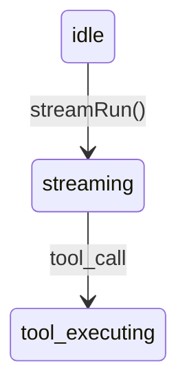

# Wiki Authoring

You are writing an internal design document for **a new teammate**: a competent engineer who knows general software concepts but knows nothing about this project's names, abbreviations, or conventions.

They must be able to read your document top to bottom and understand the subsystem **without opening the source first**. If they have to already know the codebase to parse your first paragraph, the document has failed — no matter how accurate it is.

## Reader contract (non-negotiable)

1. **Plain-language entry.** The first paragraph after `## Overview` must answer three things using **no project-specific proper nouns**: what this is, what problem it solves, and who or what depends on it. Save type names, file paths, and internal jargon for the paragraphs after it.
2. **Explain a term the first time it appears.** Any project-specific noun — a type, a subsystem, an internal concept, an abbreviation — gets a one-clause gloss on first use. `AgentLoopRuntime`(一个会话一个实例的编排器) is enough. Never gloss the same term twice.
3. **Progressive order.** Within the document and within each `##` section: what it is → why it exists → how it works → where it breaks. Do not open with an interface dump.
4. **One idea per sentence.** If a sentence has three clauses and four inline identifiers, split it. Density is not depth.

## Depth bar

Readability is the floor, not the ceiling. Still required:

- Every `##` section needs at least one substantive prose paragraph — concrete mechanisms, not a single line or a bare bullet dump.
- Answer every keyQuestion from the outline explicitly. If a question has no answer in the code, say what is missing and name what you checked.
- Prefer **showing** interfaces (fenced code), state machines (tables or mermaid), and runtime behavior over merely naming files.
- Every major claim is traceable: inline backticks, a Source line after code fences, and matching entries in `references[]`.
- Explain WHY the design exists, HOW it behaves at runtime, WHAT breaks if misused.
- Never invent a type, function, or config key that is not in Code Context or a file you actually read.

## Workflow

1. Read **Key Questions** and **Target Files** for this document — they define what "done" means.
2. Study Code Context (excerpts, symbols, imports) as primary evidence; use `file.read` on targetFiles for gaps.
3. Draft the skeleton: `#` title + italic subtitle → `##` sections mapped 1:1 to keyQuestions.
4. Write the Overview plain-language paragraph **first**, before any technical section. If you cannot write it without jargon, you do not yet understand the subsystem — read more code.
5. Write each section: opening prose → evidence (code / table / diagram) → callout if there is a decision or a caveat.
6. Add a Dependencies section with `[internal]` / `[external]` tags where applicable.
7. Self-check against the Pre-submit Checklist below.
8. Run `wiki.check_mermaid` on every diagram; fix syntax before submitting.
9. Call `wiki.commit_document` with `markdown`, `references[]` (line numbers where possible), and `claims[]` (load-bearing facts).

If you cannot verify a fact from code, do not assert it — mark it unknown or leave it out of `claims[]`.

## Markdown patterns

### Document opening

```markdown
# ModuleName — One-Phrase Role

*One-line subtitle: what this subsystem does and its primary integration points.*

## Overview

会话编排层负责让一次对话从用户输入走到模型回复，中间可能穿插若干次工具调用。它解决的问题是：模型的一次回复往往不是终点，需要有人把"调用工具 → 拿到结果 → 再问模型"这个循环管起来，并保证同一个会话里这些步骤不会互相打架。所有需要与模型多轮交互的功能都经过这一层。

具体到实现，`AgentLoopRuntime`(每个会话一个实例的编排器) 承担了上述职责……
```

Do **not** repeat the `#` title as the first sentence of Overview. Do **not** put a type name in the first sentence.

### Callouts

```markdown
> [!NOTE]
> **并发模型** — 子代理通过 `fork()` 创建，共享父级工具注册表但维护独立上下文。

> [!IMPORTANT]
> **关键不变量** — 单会话内 `streamRun` 串行化；跨会话完全隔离。

> [!WARNING]
> **已知限制** — 子代理层级深度超过 3 时，上下文合并可能超出 token 预算。
```

At least one callout per module / topology / flow / data document. `NOTE` = context, `IMPORTANT` = invariants and decisions, `WARNING` = limits and footguns. A callout must carry a **bold label** and a concrete mechanism — never restate the heading.

### Interface blocks

Show real types from code. After each primary interface fence, add a Source line:

```markdown
```typescript
interface AgentLoopRuntime {
  streamRun(input: RunInput): AsyncGenerator<StreamEvent>;
  pause(): Promise<PauseSnapshot>;
}
```
*Source: `api/services/agent-runtime/contracts.ts:42-71`*
```

### Tables

```markdown
| State | Description | Transitions |
| --- | --- | --- |
| `idle` | 等待输入 | `→ streaming` on `streamRun()` |
```

Tables compare structured data (states, API surface, config keys). Lists inventory dependencies or ordered steps. Neither substitutes for prose.

### Mermaid diagrams

```markdown
## State Machine


```

Put a `##` heading before each diagram. `sequenceDiagram` for flows, `flowchart` for topology, `erDiagram` for data. Use **real module and type names** — never "Service A" / "Database". Wrap node labels containing parentheses in quotes. Validate with `wiki.check_mermaid` before submitting.

### Expandable detail (optional, encouraged for module)

```markdown
<details>
<summary>Gate 决策矩阵</summary>

| mutability | internalGate | 行为 |
| --- | --- | --- |
| `read` | `none` | 直接执行 |

</details>
```

### Dependency inventory

```markdown
## Dependencies

- **[internal]** `llm-runtime/stream` — 底层 LLM provider 流式调用
- **[external]** `ai (vercel)` — streamText / generateObject 封装
```

### Cross-references

Link related wiki concepts with markdown anchors: `see [Context Compression](#context-compression)` plus a matching `## Context Compression` heading.

### references[]

Mirror every Source line and major section in `references[]` (commit payload, not the markdown body):

`{ "filePath": "api/.../contracts.ts", "startLine": 42, "endLine": 71, "symbol": "AgentLoopRuntime" }`

## Quality gates

`wiki.commit_document` **rejects** drafts that fail these. On rejection, read the error list and expand the thinnest sections first.

| docType | `##` sections | prose depth | required structure |
| --- | --- | --- | --- |
| landscape | ≥2 | ≥4 long prose lines | table + dependency/list section |
| topology | ≥2 | ≥4 long prose lines | flowchart mermaid + table + callout |
| module | ≥3 | ≥8 long prose lines | code fence + Source line + table + callout + Dependencies |
| flow | ≥2 | ≥5 long prose lines | sequence mermaid + callout + step list |
| data | ≥2 | ≥4 long prose lines | erDiagram mermaid + schema table |

Also enforced for every docType: a minimum stripped body length, and a non-empty `references[]`.

> [!IMPORTANT]
> **闸门是下限，不是目标** — 不要为了凑指标而把两句话拆成一段长句、或硬造一个没有内容的表格。先把事情讲清楚，再回头检查是否达标。

## Document skeletons

Copy the structure; add extra `##` subsections when the subsystem is large.

### module

```
# {Name} — {role}
*{subtitle}*

## Overview          → 大白话段落（无专有名词）：是什么、解决什么问题、谁依赖它；随后一段进入技术定位
## Why It Exists     → 没有它会怎样；替代方案为什么被否决
## Core Interface    → typescript fence + *Source: path:lines*
## Runtime Behavior  → 状态表 或 mermaid stateDiagram + 并发/失败行为的散文说明
## API Surface       → 表格：方法/事件 | 语义 | 副作用
> [!IMPORTANT]       → 设计决策 + 被否决的替代方案
## Dependencies      → [internal]/[external] 列表
> [!WARNING]         → 已知限制（可选）
```

### landscape

```
# {Project} — {positioning}
*{subtitle}*
## Overview          → 大白话段落：这个项目是什么、给谁用
## Tech Stack        → 表格
## Repository Layout → 列表，每个目录写职责（不是裸路径）
## Development Workflow → 散文：来自真实 package scripts 的 dev/build/test 命令
## Domain Vocabulary → 表格：术语 | 含义
```

### topology

```
# {System} Architecture
*{subtitle}*
## Overview          → 大白话段落：系统由哪几块组成、它们为什么要拆开
## System Diagram    → flowchart mermaid（真实子系统名）
## Layer Model       → 散文 + 表格：调用方 → 被调方 | 协议 | 同步/异步
> [!IMPORTANT]       → 部署/安全/性能边界
```

### flow

```
# {Flow Name} — {trigger}
*{subtitle}*
## Overview          → 大白话段落：这个流程什么时候被触发、最终产生什么结果
## Sequence          → sequenceDiagram mermaid
## Step Breakdown    → 编号散文（每步的副作用、幂等性）
> [!WARNING]         → 错误/重试/分支路径
## Involved Modules  → 列表，每个模块一句话职责
```

### data

```
# {Storage Layer}
*{subtitle}*
## Overview          → 大白话段落：存了什么、为什么这么存
## Entity Model      → erDiagram mermaid
## Schema            → 表格：字段 | 类型 | 约束
## Lifecycle         → 散文：CRUD/归档 + 一致性模型
```

## Good vs bad

BAD — 只有结论，没有机制：

> 会话编排层负责管理代理会话，处理流式输出和工具调用。

（读者知道它"负责"什么了，但不知道它怎么做到、边界在哪。）

BAD — 只有机制，没有背景：

> `AgentLoopRuntime` 是每会话编排器：`streamRun()` 将单个 LLM 流绑定到单个会话，并通过内部运行队列串行化工具执行，因此并发用户消息无法交错工具副作用；`pause()` 将进行中的工具状态快照到 SQLite，`resume()` 在接受新输入前重放挂起的工具结果。

（每个字都对，但新同事读到第三个标识符就掉队了——没有一句话告诉他这层为什么存在。）

BAD — 条目倾倒：

> - streamRun - 运行代理
> - pause - 暂停
> - resume - 恢复

GOOD — 先给入口，再给深度：

> 会话编排层解决的问题是：模型回复一次往往不够，需要有人把"调用工具 → 拿到结果 → 再问模型"这个循环管起来，并保证同一个会话里的多条用户消息不会互相打架。
>
> 承担这个职责的是 `AgentLoopRuntime`(每个会话一个实例的编排器)。`streamRun()` 把一次 LLM 流绑定到一个会话上，所有工具调用都排进一个内部队列顺序执行——这样两条并发的用户消息不会交错产生副作用。需要中断时，`pause()` 把进行中的工具状态快照写入 SQLite，`resume()` 会先重放挂起的工具结果，再接受新输入。
>
> 子代理通过 `fork()` 创建，继承父级的工具注册表，但拥有独立的消息缓冲区。父级会阻塞到子代理发出 `done` 事件，然后把摘要后的输出合并回自己的上下文。

GOOD — callout：

> > [!IMPORTANT]
> > **单会话串行** — 同一会话禁止并发 `streamRun`；新消息入队等待当前 run 的 `done` 事件。跨会话之间没有共享可变状态。

## Anti-patterns

- Overview 第一句就出现类型名、文件路径或内部缩写
- 专有名词从头到尾没有一句解释
- 段落里只有结论、没有机制；或只有机制、没有背景
- 某个 `##` 段落只有一张表或一张图，一句散文都没有
- 编造 Code Context 和 `file.read` 里都不存在的类型或函数
- mermaid 里用 "Service A" / "Database" 这类通用节点名
- 列表照抄目录树，不解释职责
- 「值得注意的是」「本模块负责」这类填充语
- callout 只是把标题换个说法重说一遍
- 为了凑 80 字符散文行而把简单的意思写成长复合句

## Pre-submit checklist

1. Overview 第一段没有任何项目专有名词，且回答了「是什么 / 解决什么问题 / 谁依赖它」
2. 每个专有名词首次出现都带了一句话解释
3. 每个 keyQuestion 都有专门的散文回答，没有孤儿问题
4. `#` 标题 + `*副标题*` 齐备；Overview 没有逐字重复标题
5. 至少一个 `> [!IMPORTANT]` 或 `> [!WARNING]`，带**粗体标签**和具体机制
6. 主接口有 fenced code block + `*Source: path:lines*`
7. 每个 `##` 段落在表格/图之前至少有一段散文（纯图示段落除外）
8. mermaid 已通过 `wiki.check_mermaid`；含括号的节点标签已加引号
9. `references[]` 覆盖所有 Source 行；module 文档的 `claims[]` 至少 2 条 load-bearing
10. 被 reject 时：读错误列表，先扩写最薄的段落，再补缺失的 callout/表格/图
