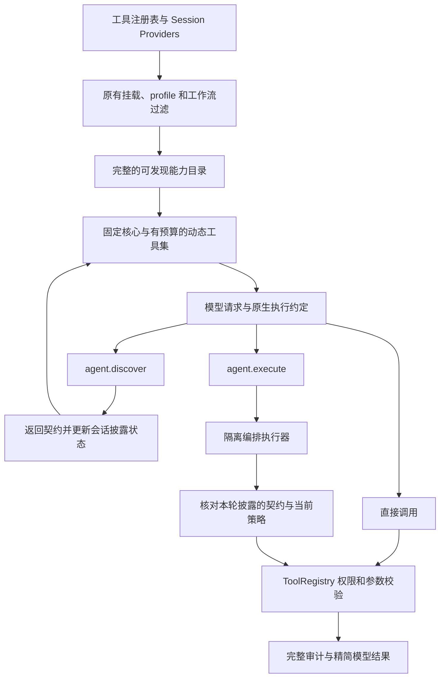

# 原生 Agent 编排与渐进式工具披露

日期：2026-10-06。状态：隔离分支实现，本地验证；真实模型任务对比和默认启用尚未完成。

## 目标与边界

将 Code Mode 从模型可选的一项业务工具，调整为原生 Agent 的执行机制。模型协议仍使用结构化调用提交程序，但发现与执行是固定的运行时入口，不需要从业务工具目录中先发现 `code.run`。

首期复用 QuickJS Worker、ToolRegistry 权限校验、资源限制、取消传播和父子调用记录。编排仍限定为已允许的只读工具；写入、Shell、CUA 和需要暂停审批的操作使用直接调用。ACP 和 Git 管理专用会话保留自己的工具契约。

## 执行链路

注册、获准使用、已披露和可编排是不同状态。披露不会授予权限，历史记录也不能成为当前调用许可。完整能力目录仍服务于能力 UI 和内部查找，只有模型请求的工具投影发生变化。

## 能力目录与披露

- 首轮保留文件读取、目录、搜索、差异、历史读取和必要工作流控制，以及固定的发现/执行入口。简单读取不需要增加一次发现请求。
- 其他工具使用 `agent.discover({query?, group?, ids?, cursor?})` 查询。可精确加载最多 4 个 ID，也可不带搜索词分页遍历目录，避免仅凭关键词才能找到隐藏能力。
- 每页最多返回 4 个完整契约。动态工作集最多 12 个契约，估算 token 上限 8,000；该预算独立于固定核心。token 使用现有 tokenizer，不能视为各模型计费的精确值。
- 契约包含运行时 ID、完整说明、JSON Schema、内容版本、分组及是否可编排。序列化失败或超过预算会明确返回原因，不会悄悄加载全部 schema。
- 发现结果更新待披露状态，在下一次模型请求中加入对应直接调用 schema；本轮已经发给模型的契约快照保持独立。不能在同一步发现一个未知工具后立即编排调用它。
- 动态条目按最近使用/披露时间保留，超出预算时回收较旧条目。撤销或 schema 变化会使条目失效。
- 命名采用稳定规则，避免后续披露具有冲突名称的工具时改变先前工具名；历史名称解析与当前调用解析分开。回退路径保留旧命名规则。

## 原生编排

`agent.execute({code})` 是固定的运行时提交入口。运行时共享编排服务承接它和旧 `code.run`，业务工具目录不再决定是否能找到编排能力。

脚本使用 `await tools.call(runtimeToolId, args)`，并返回小型 JSON 汇总。运行时在每个内部调用前检查：

1. 工具契约是否在本轮实际披露，版本是否仍有效。
2. 工具当前是否已挂载、profile 是否允许、是否在可编排范围。
3. 原有工具参数校验、工作流边界和权限策略是否允许执行。

内置只读白名单和 MCP 精确允许列表保持原意。MCP 仍需声明只读，声明本身不构成授权。保持 15 秒、32 次调用、4 路并发等既有限制。

需要审批时返回失败和直接调用指引，不在脚本内部等待审批。Worker 不可用或部分调用失败时保留结果和轨迹，由后续模型步骤选择下一动作，不自动重放程序。模型历史投影保留汇总，完整父子调用保留在审计数据中。

## 恢复与压缩

会话元数据保存工具 ID、契约版本和最近使用时间，不永久保留所有 schema。每次模型请求从当前注册表重新构建有界工作集，因此历史压缩后仍能获得必要 schema。

重启后重新校验当前权限和契约版本。子会话通过 owner 检查隔离披露状态，不能继承父会话的契约快照。手动压缩采用一致的历史工具名称规则。

## 配置和发布

原生路径直接启用，不存在 Code Mode 功能开关。只有非原生后端（例如 ACP）和 Git 管理会话走各自的工具契约。旧环境变量不再控制行为。

- 设置 UI 使用“Agent 能力 / 允许只读编排”。发现机制和编排权限分别管理。
- 为兼容已有客户端，唯一持久化策略继续使用 `codeMode.enabled` 与 `codeMode.mcpTools`；不创建第二套长期有效配置。
- 配置语义版本为 `schemaVersion: 2`，原有 `version` 仍是编辑修订号。
- 旧项目的显式关闭、允许列表，以及缺少设置的旧项目均保持原意。仅在新路径开启后创建的新项目默认允许内置只读编排，MCP 列表仍为空。
- `codeMode.enabled` 和旧环境开关不再控制编排；旧配置读取时只迁移 `mcpTools`。
- 旧 `code.run` / `code.tools` 保留兼容执行与历史读取；新路径不同时把新旧入口展示给模型。

## 分阶段验收

1. **目录与基线**：核对模型请求入口、原有权限边界，固定简单读取、批量汇总、MCP 发现、审批和失败恢复场景。
2. **渐进式披露**：实际模型请求只发送当前工作集；支持精确发现、分页、预算、稳定命名和下一步生效。
3. **原生编排**：抽取共享执行服务，验证本轮契约、每次调用权限和资源限制。
4. **生命周期与迁移**：验证重启、压缩、撤销、子会话隔离、设置迁移和回退。
5. **效果验证与发布**：100 个附加工具夹具的首轮工具定义 token 至少下降 50%，简单读取无额外发现步骤；真实模型任务再比较成功率、延迟、轮次及回退率，满足目标后才扩大默认启用范围。

本地测试不能证明真实模型更常使用编排或端到端任务更快。当前将默认发布保留为后续验收项。

本地验证结果：

- 后端 8 个相关测试文件共 159 项通过；设置表单 4 项通过。
- `npm run typecheck`、`npm run typecheck:cli`、前端 `tsconfig.app.json` 类型检查通过。
- 100 个附加工具的固定夹具中，首轮工具定义估算 token 从 21,675 降至 3,235，减少约 85.1%。这是工具定义开销，不代表整个请求或端到端成本。
- 真实模型的任务成功率、延迟、轮次和回退率尚未测量；本地验证不替代发布后的模型评估。
- 按项目版本管理规则，通过 `npm run version:minor` 将隔离分支版本同步为 `1.8.0`。未提交或推送生产分支。

## 实现位置

- `services/local-node/modules/agent-runtime/native-capabilities/`：目录、披露状态、固定协议和模型投影。
- `services/local-node/modules/agent-runtime/code-mode/composition-service.ts`：共享编排和 Registry 桥接。
- `loop-runtime.ts`、`loop-ai-tools.ts`：请求工具集与稳定名称。
- `loop-model-messages.ts`、`manual-context-compaction.ts`：历史结果投影与恢复。
- `tool-mount-policy.ts`、`tool-registry.ts`：沿用授权边界，注册固定入口。
- `project-settings-store.ts`、`transport/http/projects.ts`：兼容读取与新项目初始化。
